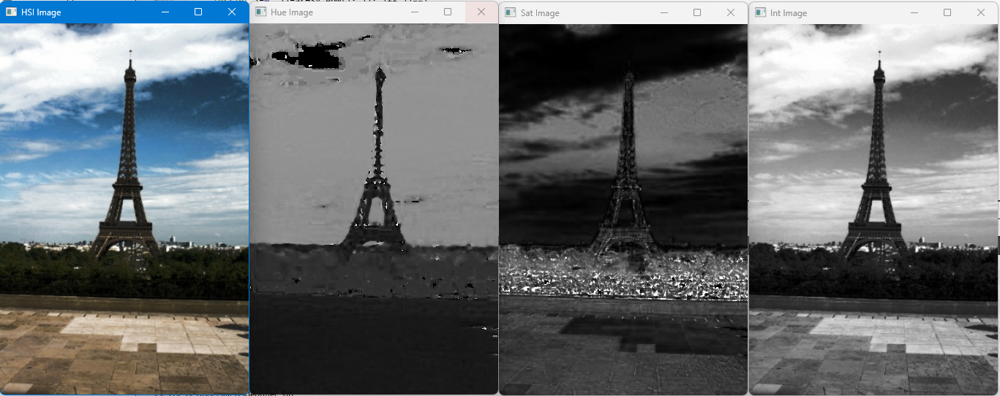
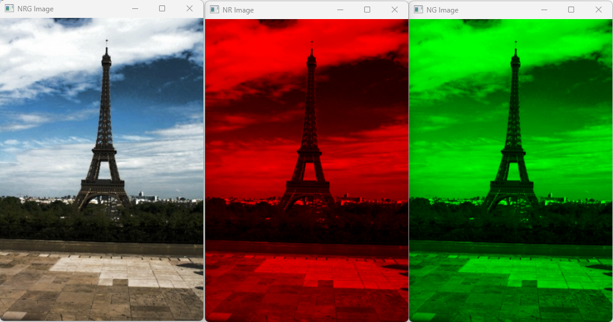
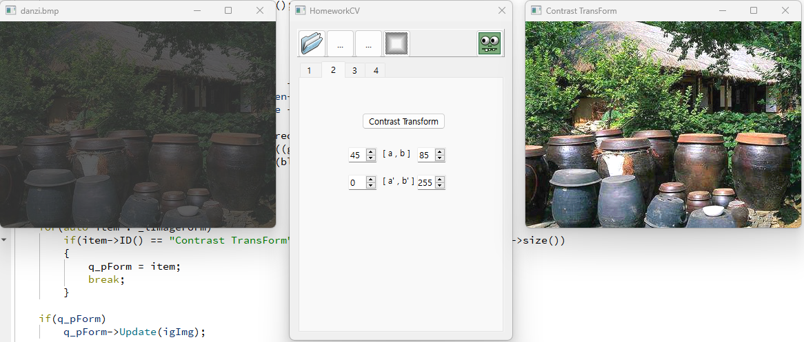
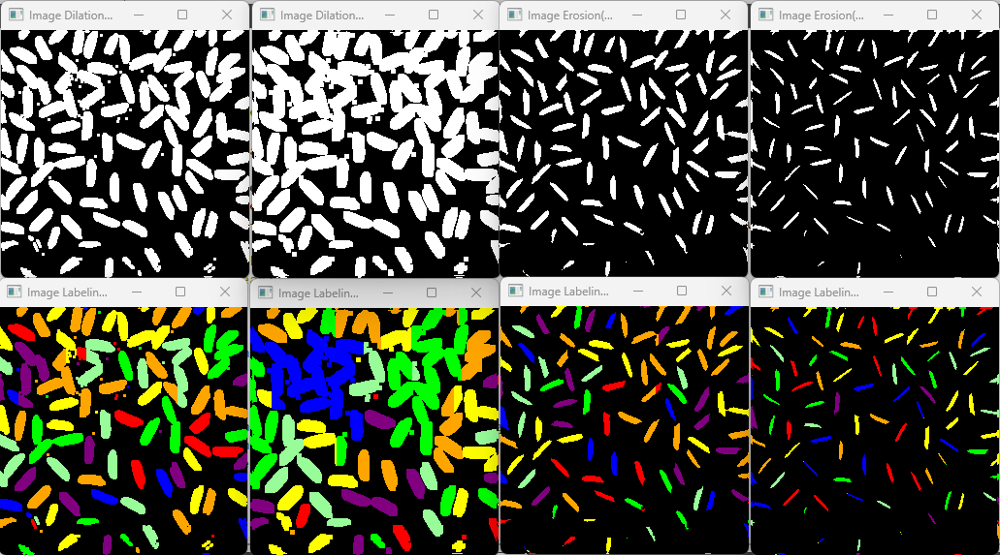
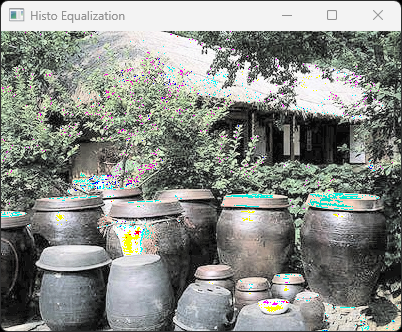
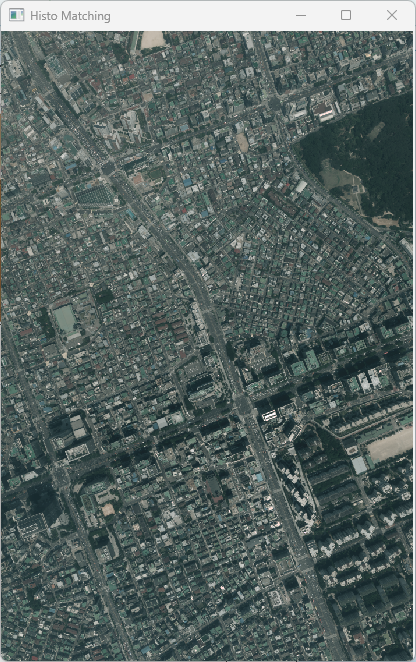
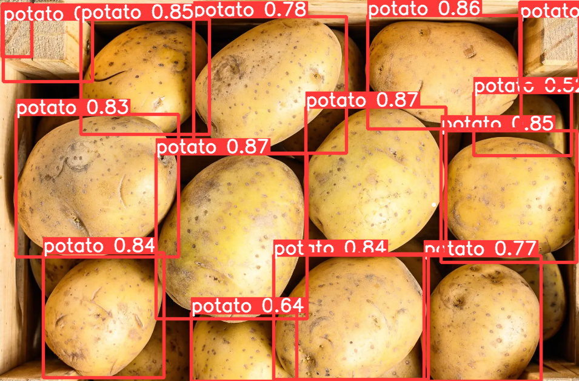
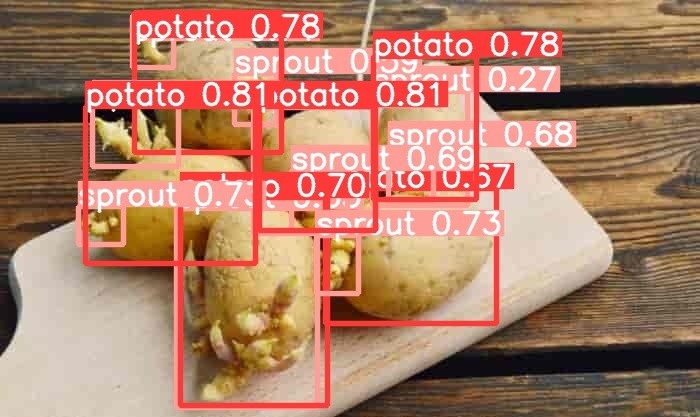
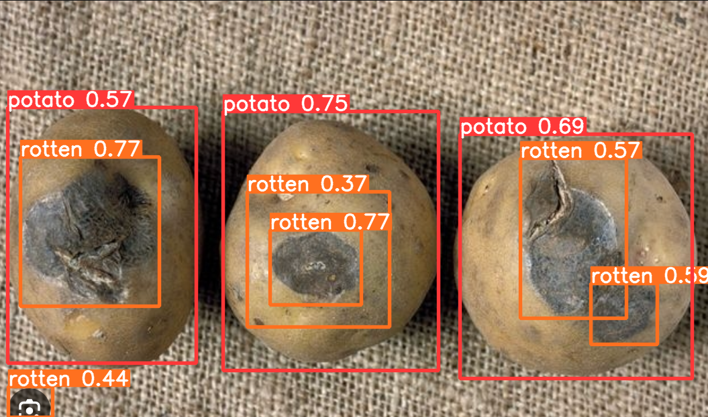

# Computer Vision

> Course assignments for **Computer Vision** (2023-2, Kwangwoon University)

Image processing algorithms implemented in C++ with Qt framework, plus a YOLOv5-based potato anomaly detection term project.

## Repository Structure

```
computer-vision/
├── 1-color-space/                   # RGB / HSI / NRG Color Space Conversion
├── 2-contrast-transform/            # Image Contrast Enhancement
├── 3-morphology-labeling/           # Morphological Ops & Component Labeling
├── 4-opening-closing/               # Opening & Closing Operations
├── 5-histogram-equalization/        # Histogram Equalization & Matching
├── 6-hough-transform/               # Hough Transform for Circle Detection
└── 7-yolov5-potato-detection/       # YOLOv5 Potato Anomaly Detection (Term Project)
```

---

## 1. Color Space Conversion

RGB to HSI / NRG color space conversion and visualization.

- **RGB -> HSI**: Hue, Saturation, Intensity decomposition
- **RGB -> NRG**: Normalized R, G channel separation

| HSI (H / S / I) | NRG (NR / NG) |
|:---:|:---:|
|  |  |

---

## 2. Contrast Transform

Basic image contrast enhancement using intensity transformation functions.



---

## 3. Morphology & Labeling

Morphological image processing with dilation, erosion, boundary detection, and connected component labeling.

- **Dilation / Erosion**: 3x3 and 5x5 structuring elements
- **Component Labeling**: N4 and N8 connectivity
- **Boundary Detection**: Contour extraction



---

## 4. Opening & Closing

Composite morphological operations for noise removal and shape refinement.

- **Opening** (erosion -> dilation): Removes small objects
- **Closing** (dilation -> erosion): Fills small holes


---

## 5. Histogram Equalization

Histogram equalization for contrast improvement and histogram matching between image pairs.

- **Equalization**: Redistributes pixel intensity for better contrast
- **Matching**: Transforms source histogram to match target histogram
- Implemented from scratch (no library functions)

| Equalization | Matching |
|:---:|:---:|
|  |  |

---

## 6. Hough Transform

Circle detection using Hough Transform for Korean coin recognition.

- **Standard Hough**: Detects circular coins (100w, 50w, 10w)
- **Generalized Hough**: Shape matching with model template
- **Preprocessing**: Canny edge detection + gradient computation


---

## 7. YOLOv5 Potato Anomaly Detection (Term Project)

Automated food safety screening system that detects sprouted and rotten potatoes using YOLOv5.

- **Dataset**: AI-hub Agricultural Product QC images
- **Classes**: Normal, Sprout, Rotten
- **Model**: YOLOv5x, 50 epochs on Google Colab
- **Accuracy**: 97% (sprout), 95% (rotten)

| Normal | Sprout | Rotten |
|:---:|:---:|:---:|
|  |  |  |

```bash
# Training (Google Colab)
python train.py --img 704 --batch 16 --epochs 50 --data data.yaml --weights yolov5x.pt
```

> Based on [ultralytics/yolov5](https://github.com/ultralytics/yolov5)

---

## Tech Stack

- **1-6**: C++ / Qt 6.5 / KFC Image Processing Library
- **7**: Python / YOLOv5 / Google Colab
