# Computer Vision

컴퓨터비전 수업에서 진행한 영상처리 프로젝트 모음.
C++/Qt 기반 영상처리 알고리즘 6개와 YOLOv5 감자 이상 탐지 텀프로젝트로 구성된다.

`C++` `Qt 6` `Python` `YOLOv5`

> Framework code (UI, image I/O 등)는 라이선스 문제로 제외하였으며, 핵심 알고리즘 구현부(`algorithms.cpp`, `mainframe.cpp`)만 포함한다. 따라서 1~6번 프로젝트는 단독 빌드가 불가능하다.

---

## 1. Color Space Conversion

RGB → HSI, RGB → NRG 색 공간 변환 및 시각화.

| HSI (H / S / I) | NRG (NR / NG) |
|:---:|:---:|
| 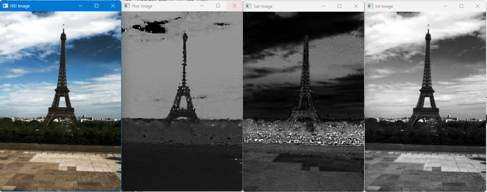 | 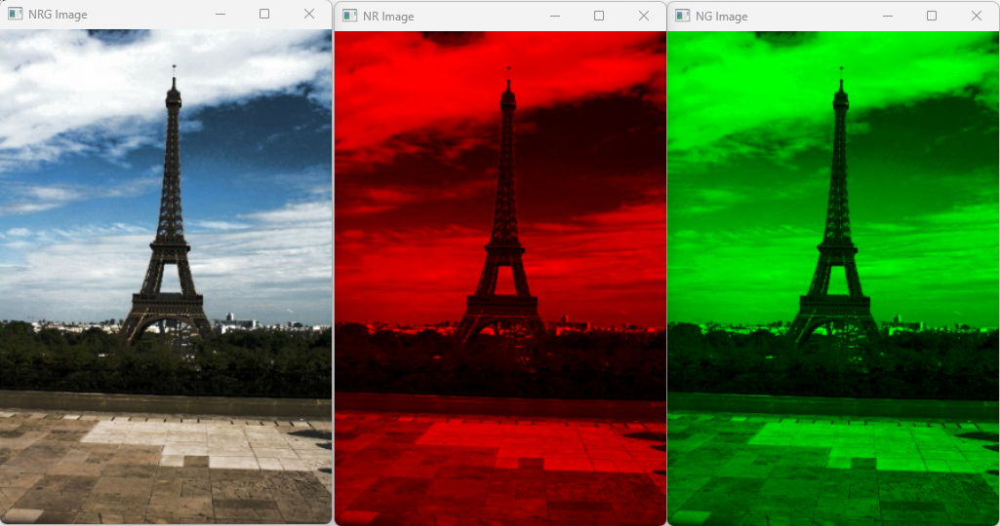 |

---

## 2. Contrast Transform

명암 변환 함수를 이용한 이미지 대비 향상.

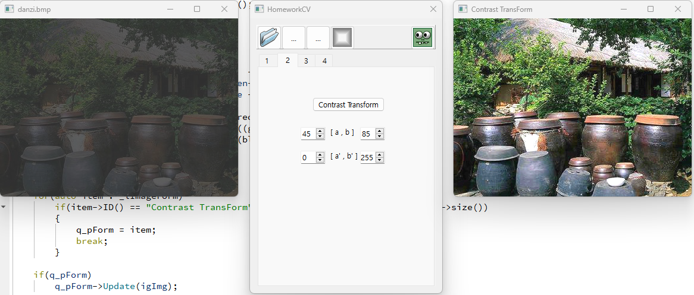

---

## 3. Morphology & Labeling

팽창/침식(3x3, 5x5), 경계 검출, N4/N8 연결 요소 라벨링을 구현하였다.

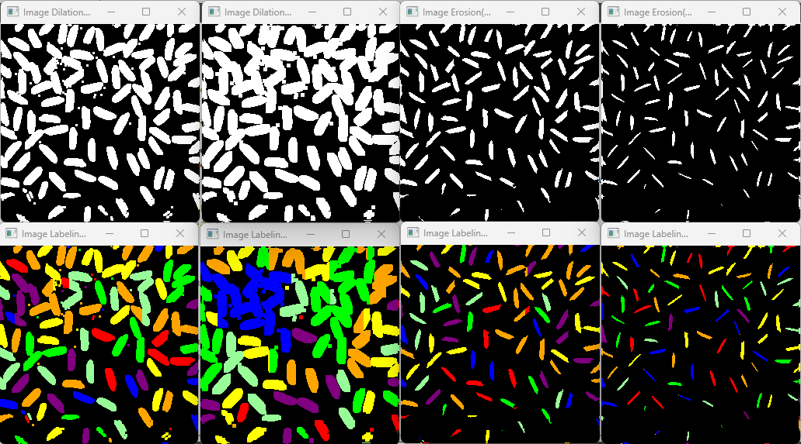

---

## 4. Opening & Closing

Opening(침식→팽창)과 Closing(팽창→침식)을 이용한 노이즈 제거 및 형태 보정.

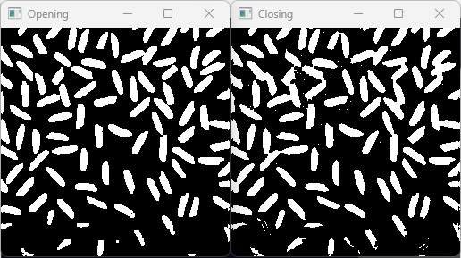

---

## 5. Histogram Equalization

히스토그램 평활화와 히스토그램 매칭을 라이브러리 함수 없이 직접 구현하였다.

| Equalization | Matching |
|:---:|:---:|
| 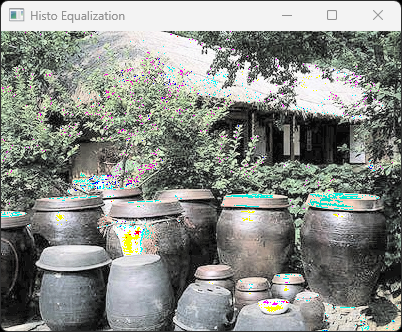 | 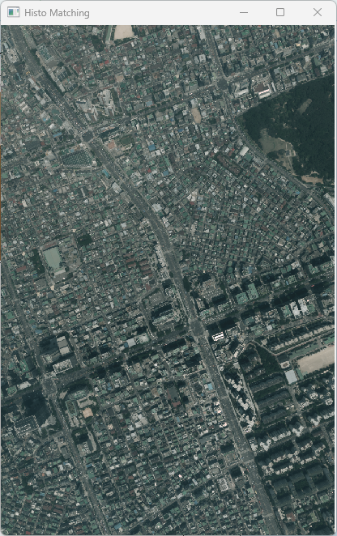 |

---

## 6. Hough Transform

Hough Transform을 이용한 원 검출. 한국 동전(100원, 50원, 10원) 인식에 적용하였다.
Canny edge detection과 gradient 계산 후 Standard Hough 및 Generalized Hough를 적용한다.

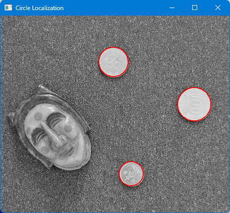

---

## 7. YOLOv5 Potato Anomaly Detection (Term Project)

YOLOv5를 이용한 감자 이상 탐지 시스템. AI-hub 농산물 품질검사 이미지로 학습하여, 정상/싹/부패 감자를 분류한다.

- YOLOv5x, 50 epochs, Google Colab
- 싹 감자 97%, 부패 감자 95% 정확도

| Normal | Sprout | Rotten |
|:---:|:---:|:---:|
| 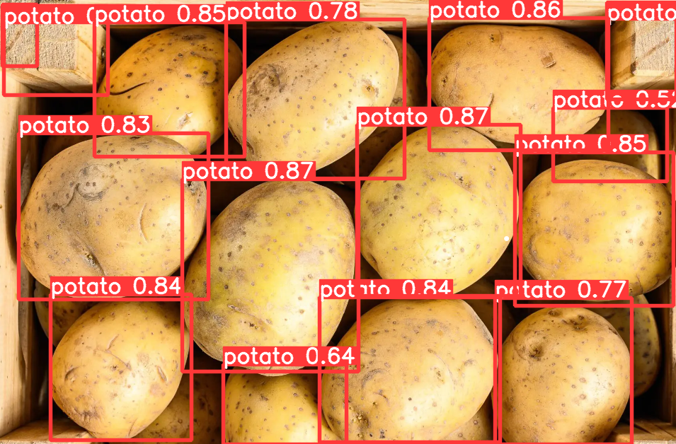 | 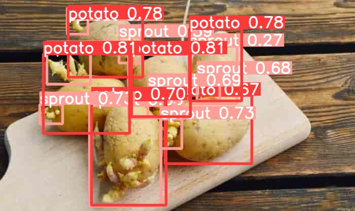 | 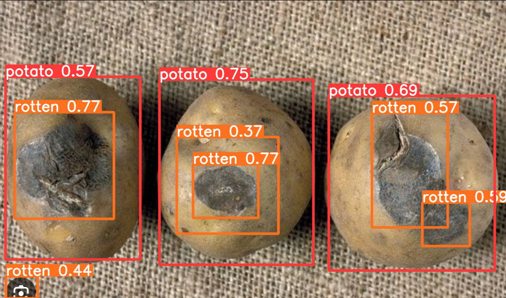 |

```bash
python train.py --img 704 --batch 16 --epochs 50 --data data.yaml --weights yolov5x.pt
```

> [ultralytics/yolov5](https://github.com/ultralytics/yolov5) 기반

---

## Tech Stack

- **1-6**: C++ / Qt 6.5
- **7**: Python / YOLOv5 / Google Colab

## Repository Structure

```
computer-vision/
├── 1-color-space/                   # RGB / HSI / NRG 색 공간 변환
├── 2-contrast-transform/            # 명암 대비 향상
├── 3-morphology-labeling/           # 모폴로지 연산 & 연결 요소 라벨링
├── 4-opening-closing/               # Opening & Closing
├── 5-histogram-equalization/        # 히스토그램 평활화 & 매칭
├── 6-hough-transform/               # Hough Transform 원 검출
└── 7-yolov5-potato-detection/       # YOLOv5 감자 이상 탐지 (Term Project)
```
